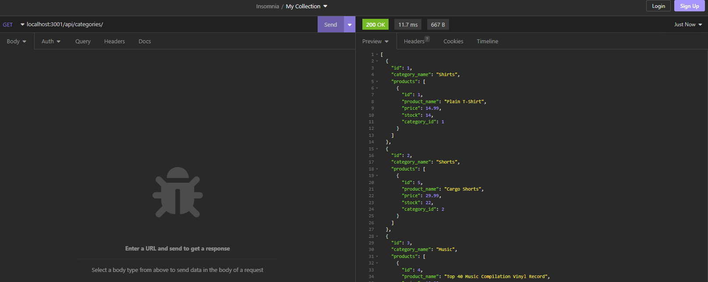
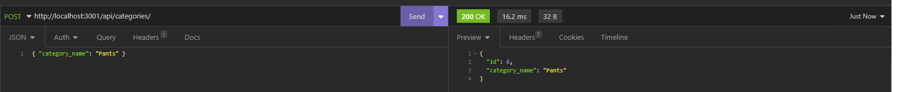
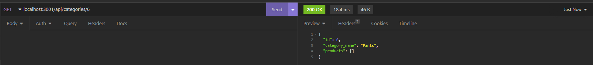
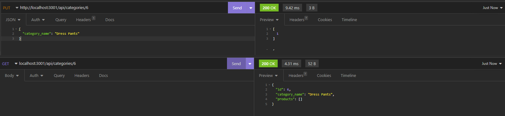
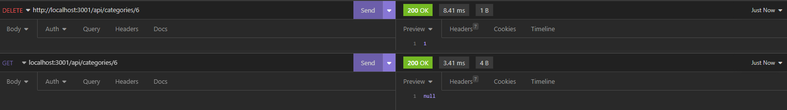

# E-Commerce-Back-End

## Description

The motivation for this project was to explore using the sequelize module with an express API in order to implement a website back-end for interfacing with an SQL database. An e-commerce back end was built with internet retail managers in mind so that their e-commerce websites may use the latest technologies and be competitive with other e-commerce companies. By building this project, I further soldified my knowledge of using sequelize, express, and MySQL2 for creating a back-end interface for databases.

## Table of Contents

- [Installation](#installation)
- [Usage](#usage)
- [License](#license)
- [Contributing](contributing)
- [Questions](#questions)

## Installation

This project uses the node modules:
- dotenv ^8.2.0
- express ^4.17.1
- mysql2 ^2.1.0
- sequelize ^5.21.7

This project uses dotenv for managing the 'DB_NAME', 'DB_USER', and 'DB_PW' environment variables that are uses in 'config/connection.js'. To configure the variables, create a '.env' file in the root project directory and provide the variable definitions there.

The command 'npm i' can be ran to install Node Package Manager, along with the above modules.

The schema.sql file in the 'db' directory contains SQL queries for initializing database.

## Usage

Before running the application, the 'ecommerce_db' database needs to be initialized with the SQL commands that are listed in 'schema.sql'. 

Once initialized, the database can be seeded with data by running 'npm run seed'. 

To run the server, use the command 'node server.js'.

Once running and seeded with data, the server listens to requests through port 3001. Insomnia is a lightweight application that can be used send requests to the server application. 

The application contains three SQL tables the user may interact with: Categories, Products, and Tags, and provides the user with five routes for interacting with each table, for example, the Category routes are:
- Get all Categories
- Create a new Category
- Get a single Category by Id
- Update a Category by Id
- Delete a Category by Id

The screenshots below show example requests and responses for managing the Category table:

'GET categories/' pulls all categories and their associated products from the db.

'POST categories/' creates a single category, requiring the 'category_name' in the request body.

'GET categories/:id' pulls a single category and their associated products.

'PUT categories/:id' updates the category with the corresponding 'id' with the data in the request body.

'DELETE categories/:id' deletes the corresponding category from the table.

The routes for the Products and Tags tables function similarly to the examples above. A demo for those routes can be found in the video demo that is linked in the Questions section.

## License

n/a

## Contributing

n/a

## Questions

A video demo of the project can be [viewed here]().

If you have any questions about the repo, open an issue or contact me directly at ryanfernandez11@gmail.com. You can find more of my work at [my GitHub page](https://github.com/ryanafernandez/).
